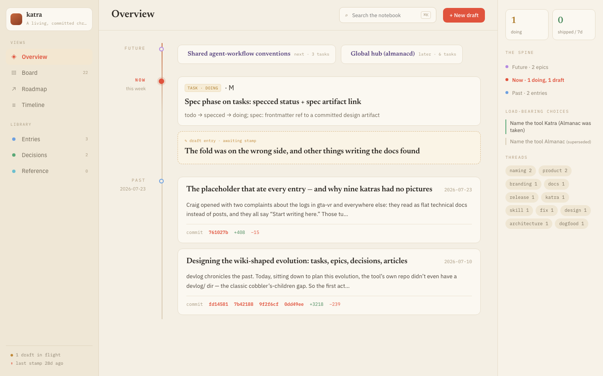
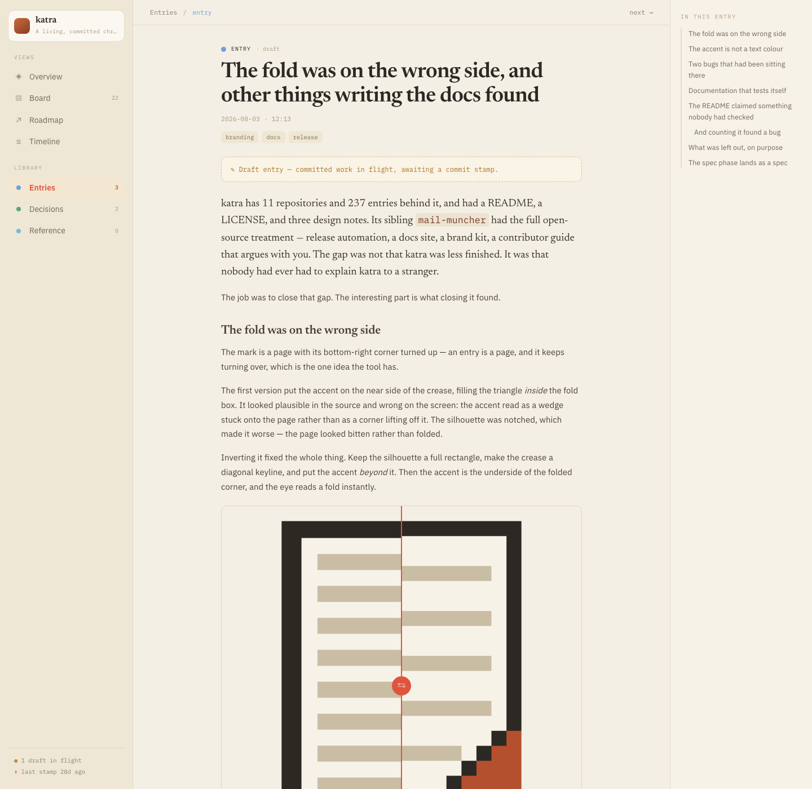
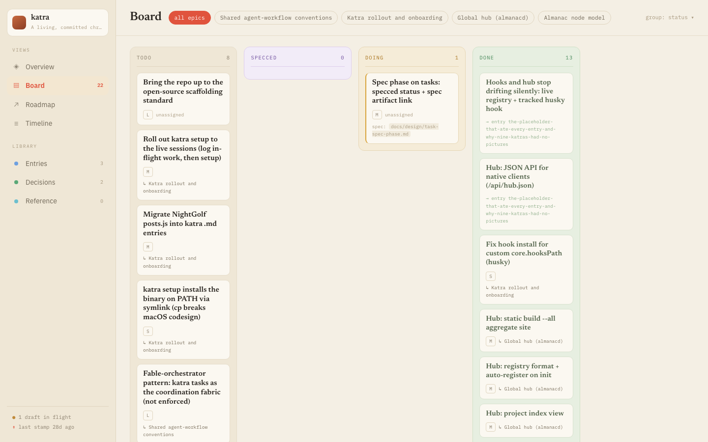
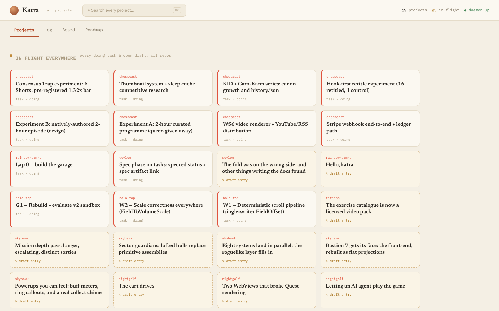

<p align="center">
  <picture>
    <source media="(prefers-color-scheme: dark)" srcset="docs/assets/brand/lockup-dark.svg">
    
  </picture>
</p>

# katra

[](https://github.com/craigjmidwinter/katra/actions/workflows/ci.yml)
[](https://pkg.go.dev/github.com/craigjmidwinter/katra)
[](go.mod)
[](https://github.com/craigjmidwinter/katra/releases/latest)
[](LICENSE)

A committed, rich-component **dev log you write as you build** — for a
developer working solo or alongside a coding agent — and the memory that makes
**spec-driven agentic development** work. Markdown entries with embedded
interactive components, stamped automatically with the commit and diffstat
they describe, served as a live, auto-reloading page.

It exists to make one workflow reliable: *chronicle the work as it happens —
the why, the dead ends, the screenshots and animations — and never lose a draft
to a "promote" step that gets skipped.*

The same store is what keeps an agent effective across sessions: designs land
as committed specs, tasks point at them, and a session starting cold reads the
spec instead of re-deriving intent from a conversation that no longer exists.
That loop is [the agent workflow](#the-agent-workflow) below.

```bash
katra setup                      # skill + hooks + auto-stamp, in this repo
katra new "Reworked the swing"   # start a draft (a markdown file)
katra capture shot.png           # drop a screenshot into it
katra compare before.png after.png
katra serve                      # live page on the LAN, reloads as you write
git commit -m "…"                # the draft is stamped with this commit
```

## The one idea

**A draft is an entry with no commit hash.** That is the entire state machine.

It appears in the *In Progress* panel the moment you create it. There is no
scratch file, no separate document, no "publish" toggle. Stamping it — adding
the hash and the diffstat — is what drops it into the log.

Everything else follows from that. Nothing can get stranded in a buffer you
forgot to promote, because there is no buffer. The log ends up in the order you
actually worked, including the parts that did not pan out, which is the half a
squashed history always loses.

## The viewer



`katra serve` renders the store as a live page — no build step, no static
site to regenerate while you write. The spine down the middle is the log in
the order it happened: future epics, the entry in flight right now, then the
past. The right rail surfaces what a flat file list buries — decisions that
are still load-bearing, and which tags a stretch of work threads through.

<details>
<summary>More screenshots</summary>

An entry, open — this one shipped mid-draft with a before/after slider
comparing two icon-mark directions, dragged in with `katra compare`:



The board, grouped by status — `specced` is its own column between `todo` and
`doing`, for the tasks that have a committed design and nobody building them
yet:



The hub, one page across every registered project on the machine — this is
the maintainer's own, 14 projects and 25 things in flight at once, none of
them re-typed anywhere:



</details>

## The problem

You finish a hard week. The commits say `fix streaming`, `wip`, `actually fix
streaming`. Six months later you need to know *why* the spawn budget is
nearest-first, and the answer is not in the diff — it was in your head, and in a
screenshot you no longer have.

The usual answers are all bad in the same way: they are a **second job**.

- A `CHANGELOG.md` records what shipped, not what you learned, and it is written
  at release time from the diff you are trying to explain.
- A wiki or a Notion page is not in the repo, so it drifts from the code
  immediately and is not there when someone clones.
- A blog post is written afterwards, from memory — which is exactly when the
  detail you needed is gone.
- Conventional commits give you a machine-readable *what* and no room for a
  *why*, a picture, or an alternative you rejected.

The common failure is that all of them are a step *after* the work, and any step
after the work gets skipped when the work runs long — precisely when the log
would have been worth most.

katra's bet is that the log has to be a **side effect of working** rather than a
task that follows it. So the draft is created when you start, it accumulates
screenshots and reasoning while you go, and the commit you were going to make
anyway is what publishes it.

## The agent workflow

This is what katra is built around, and the reason its shape is odd compared to
a static-site generator: it exists to keep two things from being lost between
agent sessions — the design an agent is meant to build from, and the record of
how the build actually went.

An agent that logs at the end writes a summary of a diff — the one thing the
diff already tells you. What is lost is everything before the final state: the
approach that failed, the measurement that changed the plan, the picture of the
bug. So katra pushes the log *into* the work, with hooks that make the draft
exist while the work does.

```bash
katra setup
```

That installs a Claude Code skill, seven hooks, and a git `post-commit`
auto-stamp. From then on:

1. **`SessionStart`** reports the active draft, unresolved memory, or in-flight
   changes that need reconciling.
2. **`PostToolUse`** records every file the agent edits.
3. **`Stop`** blocks the turn from ending if authored code changed and nothing
   declared what it was for.
4. **`PreToolUse`** blocks a `git commit` whose staged code has no
   reconciliation receipt.
5. Your commit fires the **post-commit hook**, which stamps the draft.

The gate is the part people react to, so it is worth being precise about when it
fires. It blocks only when the turn authored code that is still present in the
working tree, outside the katra directory, and nothing declared its purpose. A
conversational turn never blocks. An edit-then-revert nets to nothing and never
blocks. Someone else's pre-existing dirt is not your work and never blocks. A
blocked turn never blocks twice for the same unchanged work.

To satisfy it:

```bash
katra reconcile --advance <task>   # this moves a task forward
katra reconcile --close   <task>   # this finishes one
katra reconcile --no-task --reason "…"
katra reconcile status             # what does the gate want right now?
```

**If you are trying katra out, use `katra setup --no-gate`.** You get the
nudges and the auto-stamp without anything blocking a commit, and you can turn
the gate on later by re-running `katra setup`. A blocking hook in every
repository is a real change to how committing feels, and it should be a choice
made on purpose.

There is also an MCP server (`katra-mcp`) for clients that would rather call a
tool than shell out — and none of this is required. Any agent that can run
`katra new`, `capture`, `append` and `stamp` can keep a katra. Full detail:
[docs/agents.md](docs/agents.md).

### Spec-driven, not spec-derived

A task can carry `spec:` — a node slug in the katra (a decision, an article, an
entry) or a path relative to the repository root, resolved the same way as a
`[[wikilink]]`. `katra task spec <slug> <ref>` attaches it, and moves the task
from `todo` (or empty) to a new status, `specced`: *a design exists, committed,
and nobody has started building it.*

```bash
katra decide "Cache invalidation: TTL, not events"   # write the design
katra task spec cache-swap cache-invalidation-ttl-not-events   # by node slug
katra task start cache-swap                          # -> doing, implement from it
```

The benefit is implementation efficiency and it compounds across sessions: an
agent starting cold — new context window, different day — reads the spec
instead of re-deriving intent from a conversation that no longer exists.
`katra task list --status specced` is the worklist. Nothing requires a spec;
`todo → doing` is still legal, and most tasks don't warrant one. `specced` is
just a place to stand between "we should do this" and "someone is doing it,"
for the tasks where a design is worth writing down first — and the entries you
write while implementing become the other half of the record: what the spec
proposed against what actually happened, dead ends included.

### It reads the agent's own memory

Claude Code keeps native per-project memory. katra can ingest it into a private
ledger, so the log gets the play-by-play without anyone re-typing it. Only
`metadata.type: project` memories are admitted by default — not `user` (who you
are), not `feedback` (how you like to be worked with), because neither belongs
in a committed log. Anything matching a secret detector, or a term you list in
`sensitiveTerms`, is quarantined rather than offered.

The ledger itself lives at `katra/.state/memory-ledger.json` and is
**deliberately local and gitignored** — raw agent memory is unreviewed text
about you and your machine, and it should never reach a shared branch by
default; only the prose you choose to write from it does. So "review" means the
`katra memory scan | status | resolve | ignore` queue *on the machine that
produced it*: a teammate cloning the repo gets your entries, not your ledger.

## Alternatives

Read this before adopting. Several tools do part of this, and some of them are a
better fit than this one.

| Tool | Use it instead when |
| --- | --- |
| [Keep a Changelog](https://keepachangelog.com/) + [release-please](https://github.com/googleapis/release-please) | You want a release-facing record of *what shipped*, for users. That is a different document from a working record of *why*, and most projects should have both. |
| [adr-tools](https://github.com/npryce/adr-tools) / [Log4brains](https://github.com/thomvaill/log4brains) | Architecture decisions are the only thing you want to record. ADRs are a tighter, more disciplined format; katra's `decide` is a deliberately lighter-weight cousin. |
| Obsidian, Logseq, a wiki | The notes are personal and span projects, and being in the repo is not the point. katra is per-repository and committed on purpose. |
| Hugo, Jekyll, Astro | You are writing a public blog. They have themes, feeds, taxonomies and an audience; katra has none of those and does not want them. |
| Notion, Linear, Jira | You need assignees, permissions and a shared team workflow. katra's tasks exist to be linked from entries, not to run a team. |
| `git log` and good commit messages | Honestly, quite often. If your commits already carry the reasoning and you never need a picture, you do not need this. |

What none of them do, and what this tool exists for: keep the log **inside the
repo**, **written while the work happens** rather than after it, with
**screenshots and interactive components inline**, published by **the commit you
were making anyway**. If you do not need all four, one of the above will serve
you better and has years more mileage.

## Install

Binaries ship for macOS and Linux, amd64 and arm64. There is no Windows
build; Windows is untested and unsupported.

### Homebrew

```bash
brew install craigjmidwinter/tap/katra
```

That taps [craigjmidwinter/homebrew-tap](https://github.com/craigjmidwinter/homebrew-tap)
and installs prebuilt binaries. `brew upgrade katra` tracks new releases.

### Download a binary

Every [release](https://github.com/craigjmidwinter/katra/releases/latest) ships
archives for macOS and Linux on both amd64 and arm64, each containing **both**
`katra` and `katra-mcp`, plus a `checksums.txt` and a signature over it.

```bash
# Latest release, without the leading v. Set this by hand to pin a version.
VERSION=$(curl -fsSL https://api.github.com/repos/craigjmidwinter/katra/releases/latest \
  | sed -n 's/.*"tag_name": *"v\{0,1\}\([^"]*\)".*/\1/p')

OS=$(uname -s | tr '[:upper:]' '[:lower:]')     # darwin | linux
ARCH=$(uname -m | sed 's/x86_64/amd64/;s/aarch64/arm64/')

curl -fsSLO "https://github.com/craigjmidwinter/katra/releases/download/v${VERSION}/katra_${VERSION}_${OS}_${ARCH}.tar.gz"
tar xzf "katra_${VERSION}_${OS}_${ARCH}.tar.gz" katra katra-mcp
sudo install -m 0755 katra katra-mcp /usr/local/bin/
```

On macOS, a binary you downloaded yourself is quarantined by Gatekeeper. Clear
it with `xattr -d com.apple.quarantine /usr/local/bin/katra`, or use the
Homebrew install above, which does this for you.

#### Verify what you downloaded

```bash
curl -fsSLO "https://github.com/craigjmidwinter/katra/releases/download/v${VERSION}/checksums.txt"

# Linux
sha256sum --check --ignore-missing checksums.txt
# macOS
shasum -a 256 --check --ignore-missing checksums.txt
```

Then the signature over `checksums.txt`. Releases are signed keylessly with
[cosign](https://docs.sigstore.dev/cosign/system_config/installation/) — there
is no public key to fetch and no private key anyone has to guard. The signing
certificate is issued to the release workflow's own GitHub OIDC identity and
recorded in the public Rekor transparency log, so what you are checking is
"this was built by `release.yml` in this repo, from a tag":

```bash
curl -fsSLO "https://github.com/craigjmidwinter/katra/releases/download/v${VERSION}/checksums.txt.sig"
curl -fsSLO "https://github.com/craigjmidwinter/katra/releases/download/v${VERSION}/checksums.txt.pem"

cosign verify-blob \
  --certificate checksums.txt.pem \
  --signature checksums.txt.sig \
  --certificate-identity-regexp '^https://github\.com/craigjmidwinter/katra/\.github/workflows/release\.yml@refs/tags/' \
  --certificate-oidc-issuer https://token.actions.githubusercontent.com \
  checksums.txt
```

### `go install`

The right path if you already have Go 1.25 or newer:

```bash
go install github.com/craigjmidwinter/katra/cmd/katra@latest
go install github.com/craigjmidwinter/katra/cmd/katra-mcp@latest
```

Install both. `katra-mcp` is not optional extra tooling — the skill and every
MCP client wiring assume it sits beside `katra` on your `PATH`.

Note that `go install` builds report `dev` for `--version`, because the version
is stamped at link time and the `go` tool does not do it. Released binaries and
`make build` report the real tag. If you file a bug from a `go install` build,
say which commit you installed.

### Build from source

```bash
git clone https://github.com/craigjmidwinter/katra
cd katra
make install        # both binaries into GOBIN, version stamped
```

`make build` writes into `./bin/` rather than the repo root, because katra
dogfoods itself and `./katra` is the directory its own log lives in.

`make snapshot` builds the full set of release archives locally (requires
[goreleaser](https://goreleaser.com)) if you want to check what a release would
contain.

## Quickstart

About five minutes, from inside a git repository.

1. **Set it up.**

   ```bash
   katra setup --no-gate
   ```

   ```
   ✓ created katra store → …/katra
   ✓ skill → …/.claude/skills/katra/SKILL.md
   ✓ hooks → …/.claude/settings.json (session nudges + no commit gate)
   ✓ git post-commit auto-stamp → …/.git/hooks/post-commit
   ✓ registered with the katra hub
   ```

   Creates `katra/`, installs the skill and hooks, installs the git
   auto-stamp, and registers the project with the hub. Without Claude Code,
   `katra init --install-hook` does the store and the git hook only.

2. **Start a draft, add to it, drop in a screenshot.**

   ```bash
   katra new "Reworked the swing arc" --tags physics,gameplay
   katra append "The magnus model was fighting the animation, not the physics."
   katra capture ~/Desktop/swing.png --caption "after the fix"
   ```

   ```
   ✓ draft created: katra/entries/2026-08-20-reworked-the-swing-arc.md
     slug: reworked-the-swing-arc
   ✓ appended to reworked-the-swing-arc
   ✓ imported media/swing.png
   ✓ added to reworked-the-swing-arc
   ```

3. **Serve it.**

   ```bash
   katra serve
   ```

   ```
     local:   http://localhost:8080/
     network: http://192.168.1.23:8080/   (one line per LAN interface)
     watching katra — open tabs reload on change. Ctrl-C to stop.
   ```

   Leave that running; open tabs reload as you write.

4. **Commit as usual.**

   ```bash
   git commit -m "Reworked the swing arc"
   ```

   The post-commit hook stamps the draft with that commit's hash and
   diffstat. Without the hook: `katra stamp` (HEAD), or `katra stamp --hash
   a1b2c3,d4e5f6` for a chapter of several commits.

5. **Confirm it landed.**

   ```bash
   katra list
   ```

   ```
   2026-08-20 16:06:54  Reworked the swing arc   [12acf46]  (+261 −0)
   ```

   A stamped entry, off the commit you already made — the guaranteed visible
   success this quickstart ends on.

To publish a static copy:

```bash
katra build --out ./site
```

A self-contained directory — `index.html`, `data.json`, media — with no external
requests. Host it anywhere, or open it from a USB stick.

## Rich components

A component is a fenced code block whose language names it. The source stays
readable and diffable; the page shows the widget.

````markdown
```compare
before: media/bunker_before.png
after:  media/bunker_after.png
caption: Bunker reshape
```

```gallery
- src: media/a.png
  cap: tier one
- src: media/b.png
  cap: tier two
```

```video
src: media/horde.mp4
loop: true
```

```embed
src: media/frame-times.html
height: 480
caption: Frame time vs district count
```

```note
A callout. **Markdown** works inside it.
```

```warning
Same, with a warning style.
```
````

Plain `` images get a lightbox for free.

**An unregistered language renders as an ordinary code block.** That is the
compatibility rule for the format, not a fallback: an entry written against a
newer katra still renders in an older one, just less prettily.

There is no chart component, deliberately. You author a self-contained HTML
figure and capture it — `katra capture` recognises `.html` and emits an `embed`
block — so any chart you can draw is available rather than a fixed set of types.
[examples/media/frame-times.html](examples/media/frame-times.html) is a worked
one, and [examples/entry.md](examples/entry.md) exercises every component in a
single entry (CI renders it on every push, so it cannot rot).

Adding a component is one `ComponentFunc` in `internal/core/render.go` — that is
the whole extension surface. Full reference:
[docs/components.md](docs/components.md).

## On-disk layout

**The files katra writes are its public API.** They are markdown in your
repository, readable without the tool, and they outlive it.

```
katra/
  config.yml        title, accent, hook behaviour, memory settings
  entries/          one .md per post
  tasks/  epics/  decisions/  articles/
  media/            images, gifs, video, html embeds
  .state/           machine state — ledger, receipts (gitignored)
```

```yaml
---
title: Reworked the swing arc
date: "2026-08-03"
tags: [physics, gameplay]
hash: 5ddc0f5          # or  hashes: [a, b]  for a chapter of commits
stat: {f: 12, a: 340, d: 50}
summary: tuned the magnus model      # optional, for the index
featured: true                       # optional → "Deep Dives" zone
cover: media/hero.png                # optional banner image
---

Markdown body. Write the *why*, not a paraphrased diff.
```

A directory is a katra if and only if it holds `config.yml`. The conventional
name is `katra/`; `devlog/` is the pre-rename name and is still discovered, so
older repositories keep working without migration.

The compatibility rules a consumer can rely on: an unknown frontmatter key is
ignored, an unknown fence degrades to a code block, and an absent `type` means
`entry`. Full contract: [docs/format.md](docs/format.md).

## Commands

| Command | What it does |
|---|---|
| `katra setup [--no-gate]` | Skill + hooks + git auto-stamp + hub registration. Idempotent. |
| `katra init [--title T] [--install-hook]` | Scaffold a katra without the agent wiring |
| `katra new "Title" [--tags a,b] [--featured]` | Start a draft entry |
| `katra append [text] [--entry slug] [--file -]` | Append markdown to a draft |
| `katra capture <file> [--caption C]` | Import media into the active draft |
| `katra compare <before> <after>` | Add a before/after slider |
| `katra stamp [--hash H…] [--closes task]` | Stamp the draft with commit + diffstat |
| `katra list [--drafts] [--json]` | List entries |
| `katra serve [--port N]` | Live, auto-reloading page on the LAN |
| `katra build [--out dir] [--all]` | Build a static site |
| `katra hook install \| uninstall` | Manage the auto-stamp git hook |
| `katra doctor` | Find dangling media, parse errors, entries with no visual, stale epics |
| `katra task \| epic \| decide \| article` | The node model |
| `katra task spec <slug> <ref>` | Point a task at its committed spec (`todo`/empty → `specced`) |
| `katra reconcile …` | Declare what the current work is for |
| `katra memory scan \| status` | Claude Code memory ingest |
| `katra hub serve \| list \| scan \| install` | Across every registered katra |

Full reference: [docs/cli.md](docs/cli.md).

## Git integration

`katra stamp` reads `git` to resolve the hash and compute the diffstat
(`--numstat`). The optional **post-commit hook** removes the "forgot to stamp"
failure mode entirely:

```bash
katra hook install
```

After each commit it stamps the active draft with that commit, skipping its own
bookkeeping commits and commits that only touch the katra. By default the stamp
is left as a working-tree change for you to commit; set `autoCommit: true` in
`config.yml` to have the hook commit it itself.

The hook honours `core.hooksPath`. Under husky it installs to the tracked
`.husky/post-commit`, **not** the generated `.husky/_/`, which husky rewrites on
every `npm install` — and whose shim exits before anything appended to it would
run.

## The hub

A katra is per-repository, which is right for the log and wrong for "what have I
been doing?".

```bash
katra hub serve          # http://localhost:4200 — every registered katra
katra hub install        # run it at login (macOS launchd)
```

One project index, a cross-project board and roadmap, a merged chronological
log, and every project's own viewer under `/p/<id>/`. The registry lives at
`~/.config/katra/registry.yml` and is pruned as a side effect of reading it, so
a project you deleted stops appearing without a cleanup step.

`katra build --all` produces the same thing as a static directory. There is no
hosted service, no account, and no sync. [docs/hub.md](docs/hub.md);
[`contrib/`](contrib/) has the launchd agent and a systemd unit.

## Contributing

PRs are welcome — [CONTRIBUTING.md](CONTRIBUTING.md) has the setup, the test
and lint commands, and the invariants a change should hold.
[RELEASING.md](RELEASING.md) covers how a release actually ships, for anyone
cutting one.

## Status and scope

Pre-1.0, and written by one person for their own projects. The concrete
version of that, since "battle-tested" is easy to say and easy to check:
**11 repositories, 237 entries, over four months.** Usage is
lumpy rather than daily — one heavy month (24 of July's 31 days had an entry
written) against three sparse ones before it.

Nobody else has used it yet, so every rough edge you hit is probably one nobody
has hit.

Two things that argue for it and one that argues against, all checkable:

- The on-disk format is the stable part. It is markdown, and the compatibility
  rules above are held to deliberately.
- The tool is used to build itself, so `katra/` in this repo is a real sample of
  its output rather than a demo.
- **Keeping it wired across that many repos turned out to be a real problem.**
  An audit in August found 40 unstamped drafts, three projects that had never
  stamped an entry at all, and the agent hooks broken or missing in 9 of the 11.
  Most of that was katra's fault — the hook installer wrote into a directory
  husky regenerates, and the hub snapshotted its registry at startup — and both
  are fixed. But the honest read is that the automation was quieter about
  failing than it should have been, and `katra doctor` is worth running.

Command names and flags may still move.

### Deliberately out of scope

- **A hosted service.** Your log is markdown in your repo. There is nothing to
  sign into and nothing to migrate off, and adding a backend would trade that
  away for convenience.
- **A container image.** katra operates on your working tree, your git history
  and your hooks. Containerising it means mounting all three, at which point you
  have a worse local install.
- **A theme system.** The viewer is one design, with `accent` as the knob. The
  static build is a directory you can restyle yourself if you must.
- **Feeds, comments, analytics.** It is a log for the people in the repo.
- **Diff summarization.** katra will not write your entry from the diff. The
  diff is the thing it *cannot* tell you, and an auto-generated entry would be
  exactly the paraphrase this tool exists to avoid.

### Known limitations

- **The hub's launchd agent is macOS-only** as a first-class install.
  [`contrib/systemd/`](contrib/systemd/) covers Linux, but there is no
  `katra hub install` for it.
- **`katra serve` binds all interfaces**, so a headset or a phone on the LAN can
  reach it. There is no auth. Do not run it on a network you do not trust.
- **A slug change breaks inbound `[[wikilinks]]`.** The file path is the
  identity; `katra doctor` reports the resulting missing links, but nothing
  rewrites them for you.
- **Media is committed.** A log full of gifs is a repository full of gifs. Git
  LFS works, and nothing in katra knows or cares.
- **The `stat` diffstat counts the whole commit**, including files unrelated to
  the entry, and for a chapter it is the sum across commits. It is a sense of
  scale, not an accounting.

## Documentation

Browsable at <https://craigjmidwinter.github.io/katra/>, or in this repo:

- [docs/quickstart.md](docs/quickstart.md) — install to first stamped entry.
- [docs/components.md](docs/components.md) — every component, the exact keys
  each takes, and the recipe for charts and diagrams.
- [docs/cli.md](docs/cli.md) — every command and flag.
- [docs/configuration.md](docs/configuration.md) — every `config.yml` key, its
  default and its failure mode.
- [docs/format.md](docs/format.md) — the on-disk contract. Read it before
  writing a tool that consumes a katra.
- [docs/agents.md](docs/agents.md) — the skill, the seven hooks, the commit
  gate, memory ingest, and the MCP tools.
- [docs/hub.md](docs/hub.md) — the registry and the cross-project views.
- [docs/architecture.md](docs/architecture.md) — the seams, and where your
  change belongs.
- [CONTRIBUTING.md](CONTRIBUTING.md) — build, test, and the conventions the
  codebase holds itself to.

Runnable examples: [`examples/entry.md`](examples/entry.md) (every component in
one entry, rendered by CI), [`examples/config/`](examples/config/) (a minimal
config and a fully-commented one), and
[`examples/media/frame-times.html`](examples/media/frame-times.html) (a
self-contained chart).

## Acknowledgements

The wordmark is set in [Fraunces](https://github.com/undercasetype/Fraunces)
by Undercase Type (Phaedra Charles and Flavia Zimbardi), used under the SIL
Open Font License 1.1. Brand assets, the palette and its measured contrast
ratios are in [branding/BRAND.md](branding/BRAND.md).

## License

MIT. See [LICENSE](LICENSE).
