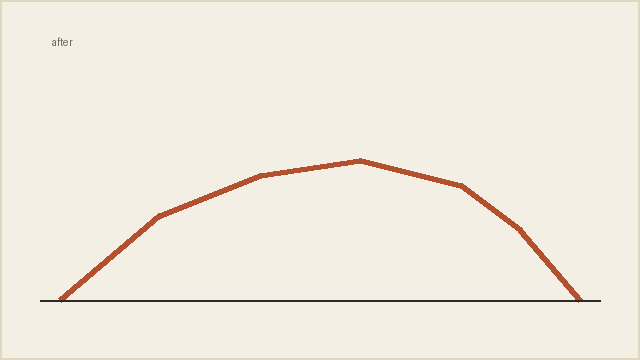

<!--
This is the reference entry. CI renders it on every push, so a component that
is renamed or broken fails the build here rather than in someone's log.

It doubles as a worked example of what a good entry looks like: it opens with
the stakes rather than the filenames, names the approach that lost, shows the
thing rather than describing it, and closes on what is still unconfirmed.

Copy it into a katra to see every component at once:

    cp examples/entry.md katra/entries/2026-01-01-components.md
    cp examples/media/* katra/media/
    katra serve
-->

Sixteen districts loaded put the frame time at 22.4 ms — twice the 11.1 ms a
90 Hz headset allows, and well past the point where the world starts to swim.
The obvious read was that we were drawing too much. The measurement said
otherwise: the draw calls were flat and the spikes tracked *spawn* events, not
district count.

## What we tried first, and why it lost

The first attempt was a straight LOD cut — halve the prop density past the
second ring. It bought 3 ms and cost the thing that made the city feel
inhabited, which is a bad trade at any price. Worse, it did not touch the
spikes at all, because the spikes were the streaming system decompressing a
district on the frame it was needed.

The fix was to stop doing the work on the critical frame: a nearest-first spawn
budget that amortizes a district's props across the frames leading up to it,
with a size-aware despawn override so the far ring gives memory back first.

```embed
src: media/frame-times.html
height: 320
caption: p95 frame time by district count, before and after the streaming fix
```

Note that the "after" line is not flat — it still climbs, just inside budget.
Sixteen districts is not the ceiling; it is the last count we have measured.

## The bunkers

Separately, and much less scientifically: the bunker silhouettes read as
jagged from the tee. The mesh was fine. The problem was that the smoothing
pass ran before the erosion pass, so erosion re-introduced exactly the facets
smoothing had just removed.

```compare
before: media/bunker-before.png
after:  media/bunker-after.png
caption: Bunker silhouette, before and after reordering the passes
```

Swapping the two passes is a one-line change in the generator and needs no new
art. The tier system it feeds was unaffected:

```gallery
- src: media/tier-one.png
  cap: tier one — a single shelf
- src: media/tier-two.png
  cap: tier two — stepped
- src: media/tier-three.png
  cap: tier three — stepped, with the lip
```

## The sweep

The streaming budget is easiest to see moving. This is one district's props
being admitted across twelve frames rather than all at once:

```video
src: media/sweep.mp4
caption: Nearest-first spawn budget, one district, twelve frames
loop: true
```

```note
The seeded layout still replays exactly. The budget changes *when* a prop is
admitted, never the RNG draw order, so a recorded round reproduces frame for
frame.
```

A plain markdown image works too, and gets a lightbox for free:



## Where it stands

Sixteen districts now sits at 12.6 ms p95, inside the 90 Hz budget with room
for the HUD. The despawn override has been running for a week without a
memory-ceiling event.

```warning
All of the above is Quest 3, measured on one device, at one build. The
frame-time numbers have not been reproduced on a Quest 2, where the memory
ceiling is lower and the despawn override is likely to matter more than the
spawn budget. Needs an in-headset capture before anyone quotes these.
```
